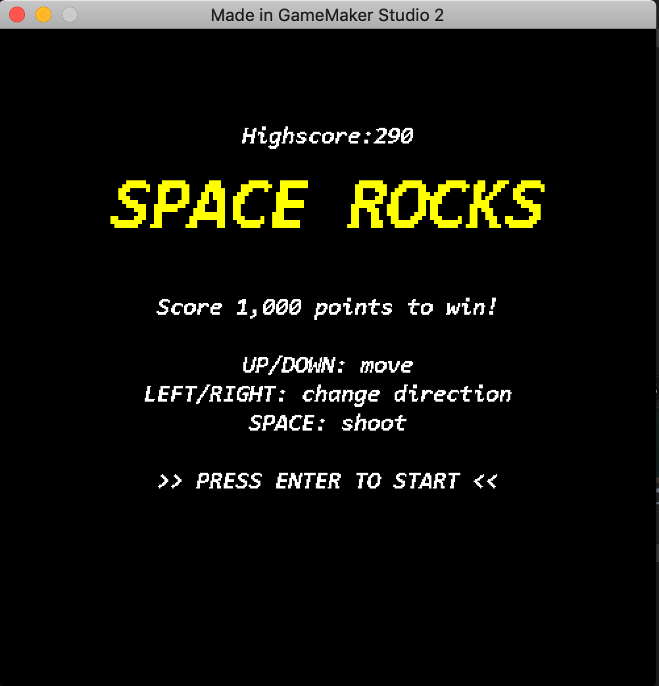
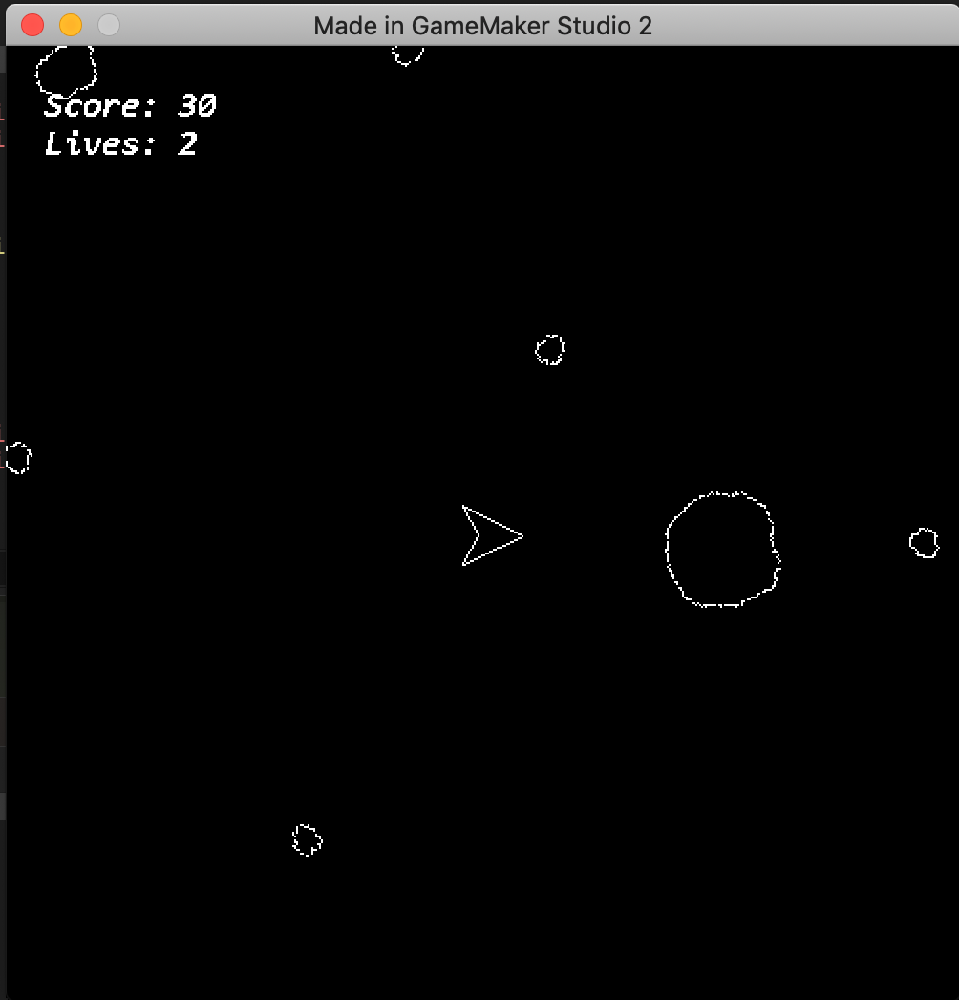

Space Rocks (aka Asteroids)

GameMakerStudio2 demo game for learning Game Maker

See [Space Rocks Tutorial](https://marketplace.yoyogames.com/assets/7423/space-rocks-gml) for details.

Here are some screenshots: 
 

I struggled to find a good game pad for mac until I found this: 

 
SteelSeries Nimbus Gamepad

Notes: The only drawback on this gamepad is that it does not have a "start" button. All of the other inputs work as expected.

In addition to doing stuff in the tutorial, I've also added a high score and gamepad inputs.

